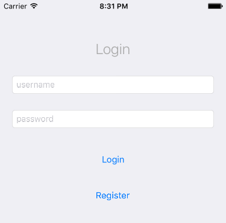
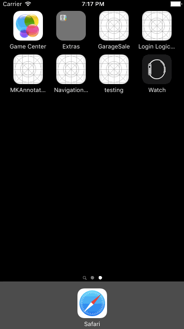

#Simple Login and Register Navigation Scheme - Managing Modal Views

This example illustrates a system to present a login and register View Controller in an app. The system presents the login or register View Controllers as modal views. A Modal View controller will appear on top of the current content, and is not part of the current Navigation Controller.

[Video Tutorials](https://www.youtube.com/watch?v=uKXyLmYA0-c&list=PLoN_ejT35AEipRnSHSv5wlHGyjOnHReqx). This Youtube playlist covers building the example from scratch. 

##Overview

###Present Modal vs Show

The most important concept show in this example is the difference between presenting a view modally vs presenting a view as
part of the navigation stack/history. A modal view appears on top of the current view, and is not part of the navigqtion controller stack/history. The gif belows shows the login view presented as the app loads. It slides up from below as a modal view. The switches between the Login, and Sign up views by swapping these modals. When a username and password are entered, the modal view is removed. Imagine the Home and TableViews as the main part of the app. These are connect together with a navigation controller. 

###Structure

All of the View Controllers are created in storyboard. The "Main App" consists of three View Controllers: Home, TableView,
and Detail View, and a Navigation controller. These are all tied together with segues and are managed by the Navigation
controller. 

The Register and Login View Controllers are also created in Storyboard, but are not tied to the other views with
a segue. Instead these to views will be instantiated with code. 

LoginManager, is a singleton used to organize and manage the login status of the app. This class is a simple halper that
doesn't do a lot. You would probably replace this with something in your app that handles authentication, or add the
authentication logic to this file. You Could also use this class as a bridge to your authentication system. LoginManager has
three properties: isLoggedIn. username, and password, and one method: loginWithuserName(_:and password:). The only things
important here are the isLoggedIn, and logInWithUserName(). 

The isLoggedIn property is Bool allows the app to see is a user is logged in or not. Any view can ask the LoginManager for
the status by checking this property. 

The loginWithuserName(_:and password) method is used to login with, you guessed it, a username, and a passord! As implemented
here this method checks only that the username, and password are not empty. If not it saves the values in the username, and
password properties (which are not used for anything), and sets the isLoggedIn property to true. The method returns a true if
the login was successful.

###Presenting a Modal View

Any View Controller that needs authentication to view can check with LoginManager to get the logged in status via:
isLoggedIn. If not logged in, a view can present the login view controller using presentViewController(:animated,
:completion). To do this we need to create an instance of the LoginViewController. In this example the LoginViewController
was created in storyboard. Use storyboard.instantiateViewControllerWithIdentifer(identifier) to create an instance of
LoginViewController. For this to work you'll need to set the Storyboard identifier. 

This system is provided as an example, there are many ways to approach it. Think of it as providing one possible solution,
for login views, an example use of modal views, and an illustration of the differences between using modals and the
navigation controller. 

